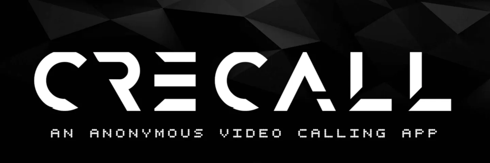

  

 

> [!CAUTION]
> Attention: I am currently experiencing issues with this application. I am trying to fix it. If you have any insights or can offer assistance, please reach out. Thank you for your understanding and support. Please contribute.

**Crecall** is a secure and anonymous video calling app that lets you connect with others without sharing personal information like email addresses or phone numbers. With Crecall, all you need is a random name and an ID to join or create a meeting.

## Why I Made This

In today's digital age, privacy is more important than ever. There are times when you need to have a meeting or a conversation, but sharing personal details isn't an option. Crecall was created to address this need. It's perfect for situations where anonymity is crucial, ensuring that your identity remains protected while still enabling seamless communication.

## Features

- **Anonymous Video Calls:** Join or create video calls without the need to provide any personal information.
- **Secure & Encrypted:** Your calls are protected with end-to-end encryption, ensuring your conversations remain private.
- **User-Friendly:** Simple and intuitive interface, making it easy for anyone to start a call.
- **Randomized Meeting IDs:** Automatically generated meeting IDs to ensure privacy and security.

## Acknowledgements

Crecall wouldn't be possible without the amazing tools and frameworks that power it:

- **TypeScript** - Ensuring robust and maintainable code.
- **Next.js** - Enabling seamless server-side rendering and static site generation.
- **shadcn/UI** - Providing a flexible and elegant UI component library.

## Contributors

## Thank You

- I hope this app will help you
